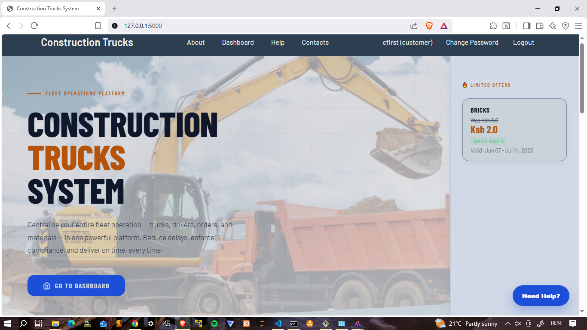
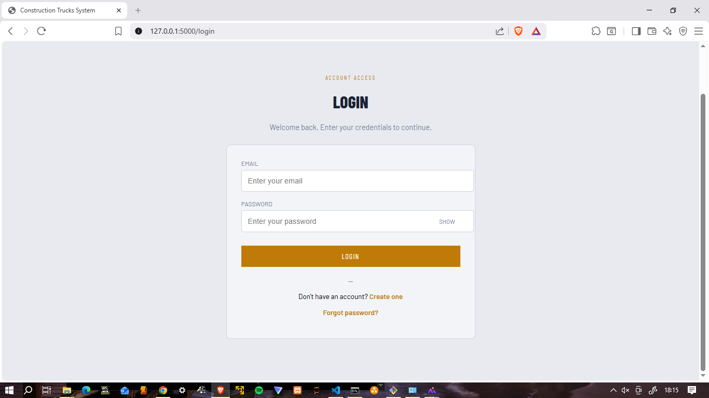
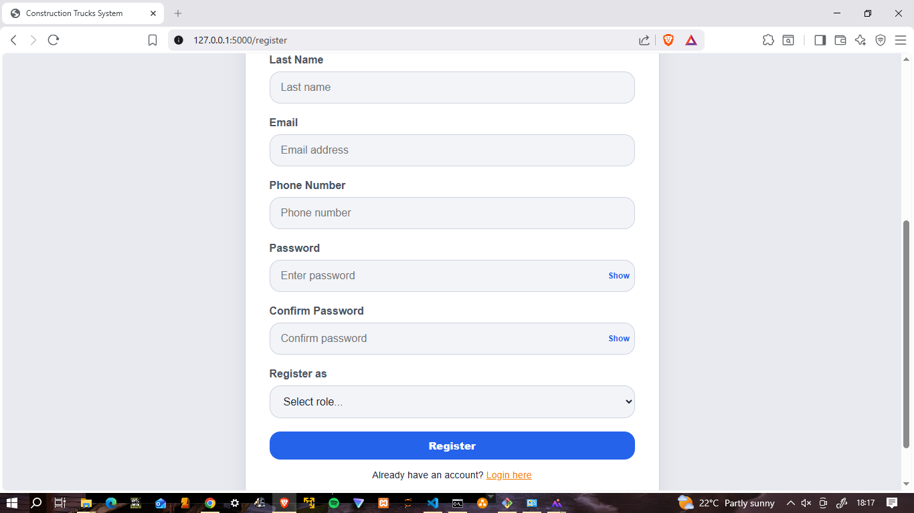
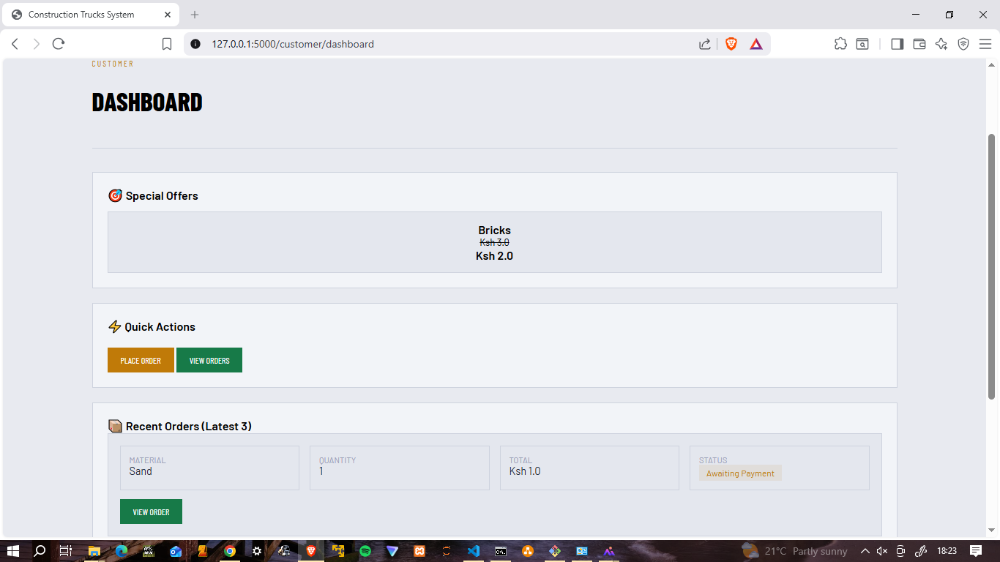
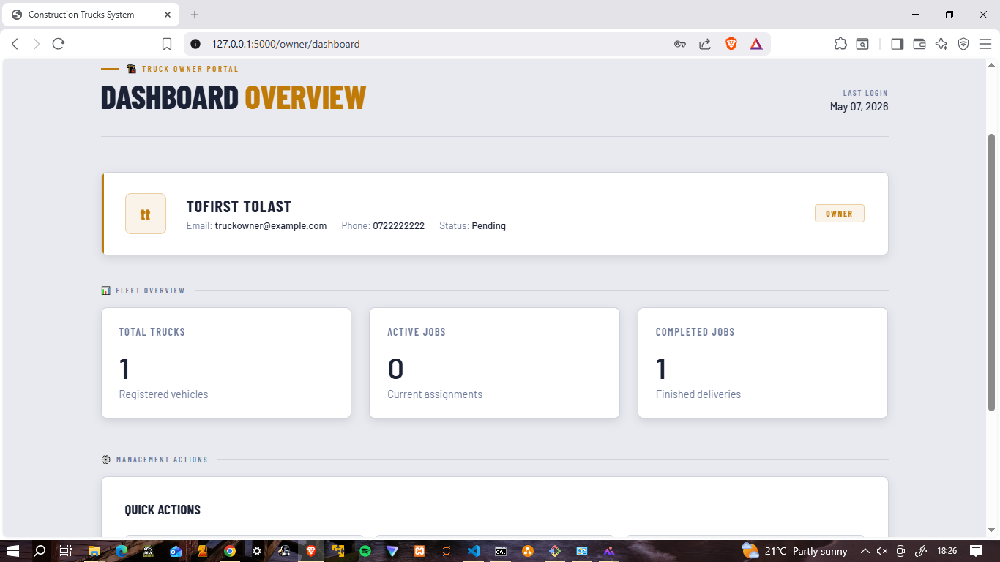
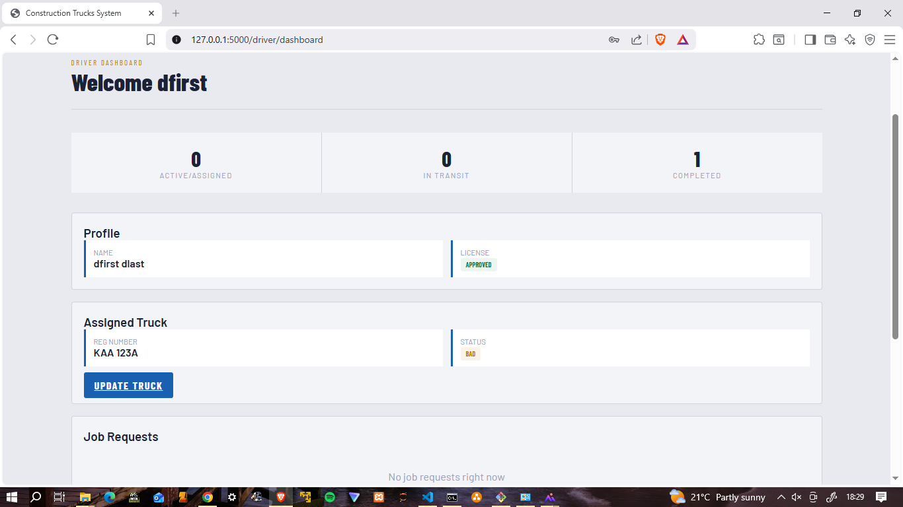
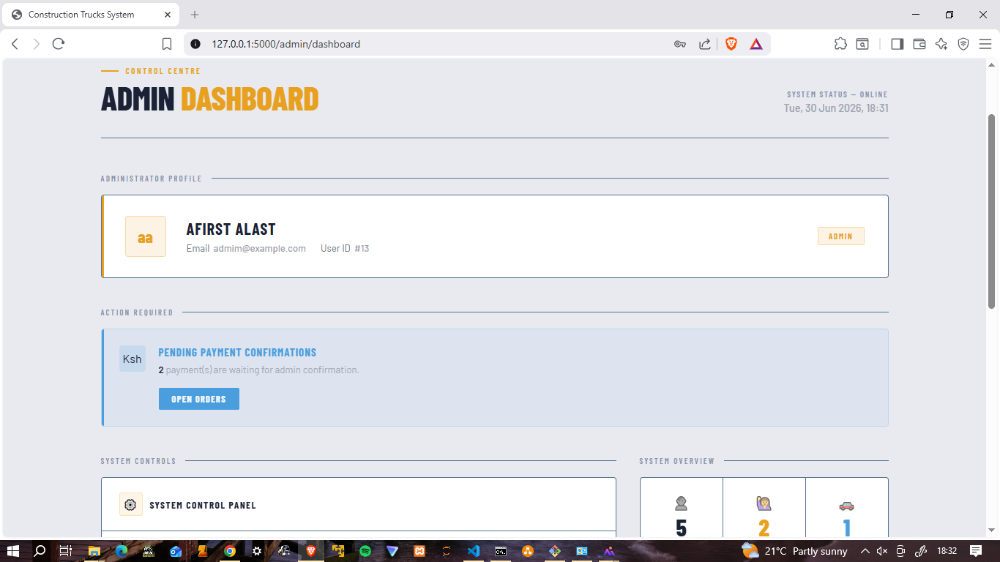

# 🚚 Construction Truck Coordination System


A web-based platform that connects customers with verified truck owners for construction material deliveries. The system simplifies the process of requesting transport services, assigning trucks and drivers, tracking deliveries, managing payments, and improving communication between all parties involved in construction logistics.

---

# 📖 Overview

The **Construction Truck Coordination System** is designed to bridge the gap between customers seeking transportation services and truck owners providing construction material delivery.

The platform enables customers to request transportation services, while verified truck owners manage fleets, assign available drivers and trucks, and oversee deliveries. Drivers receive assignments, update delivery progress, and communicate with customers. Administrators verify truck owners, monitor system activities, and ensure efficient service delivery.

The project was developed as part of the **Bachelor of Science in Computer Science** program at **Egerton University**.

---

## 🌐 Live Demo

**Try the application here:**

https://construction-truck-coordination-system.onrender.com

# ✨ Features

- ✅ Customer Registration & Authentication
- ✅ Truck Owner Registration & Verification
- ✅ Driver Management & Assignment
- ✅ Multiple Truck Management
- ✅ Construction Material Delivery Requests
- ✅ Order Tracking
- ✅ Customer–Truck Owner Messaging
- ✅ M-Pesa Payment Integration
- ✅ Reviews & Ratings
- ✅ Administrative Dashboard
- ✅ Reports & Analytics

---

# 👥 System Users

- 👤 Customer
- 🚛 Truck Owner
- 👷 Driver
- 🛠 Administrator

---

# 🔄 System Workflow

1. Customer creates an account and logs in.
2. Customer submits a transport request.
3. Truck owners receive available delivery requests.
4. Truck owner assigns an available truck and driver.
5. Driver accepts the assignment and updates delivery progress.
6. Customer confirms successful delivery.
7. Customer rates the completed service.
8. Administrator monitors, verifies, and manages overall system activities.

---

# 📸 System Preview

## 🏠 Home Page



The landing page introduces the platform and provides access to user registration and login.

---

## 🔐 Login Page



Secure authentication for Customers, Truck Owners, Drivers, and Administrators.

---

## 📝 Registration Page



Allows new users to create an account and join the platform.

---

## 👤 Customer Dashboard



Customers can request deliveries, monitor order status, communicate with truck owners, and manage payments.

---

## 🚛 Truck Owner Dashboard



Truck owners manage trucks, assign drivers, monitor deliveries, and respond to customer requests.

---

## 👷 Driver Dashboard



Drivers receive delivery assignments, update delivery status, and communicate with customers.

---

## 🛠 Administrator Dashboard



Administrators verify truck owners, manage users, approve trucks, monitor deliveries, generate reports, and oversee the entire platform.

---

# 🛠 Technologies Used

- Python
- Flask
- SQLAlchemy
- SQLite
- HTML5
- CSS3
- JavaScript
- Bootstrap 5
- Jinja2

---

# 📂 Project Structure

```text
construction-truck-coordination-system/
│
├── app/
│   ├── routes/
│   ├── services/
│   ├── static/
│   ├── templates/
│   ├── forms.py
│   ├── models.py
│   └── __init__.py
│
├── screenshots/
│   ├── home.png
│   ├── login.png
│   ├── register.png
│   ├── customer_dashboard.png
│   ├── owner_dashboard.png
│   ├── driver_dashboard.png
│   └── admin_dashboard.png
│
├── migrations/
├── config.py
├── run.py
├── requirements.txt
└── README.md
```

---

# 🚀 Installation

### Clone the repository

```bash
git clone https://github.com/Josematiko/construction-truck-coordination-system.git
```

### Navigate into the project

```bash
cd construction-truck-coordination-system
```

### Create a virtual environment (optional)

```bash
python -m venv venv
```

### Activate the virtual environment

Windows

```bash
venv\Scripts\activate
```

Linux / macOS

```bash
source venv/bin/activate
```

### Install dependencies

```bash
pip install -r requirements.txt
```

### Run the application

```bash
python run.py
```

Open your browser and visit:

```
http://127.0.0.1:5000
```

---

# 🚀 Future Enhancements

- 📍 Live GPS Tracking
- 🤖 AI-powered Truck Recommendation
- 📱 Android & iOS Mobile Application
- 💬 SMS Notifications
- 📧 Email Notifications
- ☁ Cloud Deployment
- 📊 Advanced Analytics Dashboard
- 🌍 Google Maps Integration
- 💳 Production M-Pesa Integration

---

# 🎯 Project Objectives

- Improve coordination between customers and truck owners.
- Reduce delays in construction material transportation.
- Enhance communication among customers, truck owners, and drivers.
- Improve transparency through delivery tracking.
- Simplify fleet and driver management.

---

# 📄 License

This project was developed for **academic and portfolio purposes** as part of the Bachelor of Science in Computer Science program at **Egerton University**.

Feel free to learn from the source code. If you use significant portions of this project, appropriate attribution is appreciated.

---

# 👨‍💻 Author

**Joseph Matiko**

🎓 Bachelor of Science in Computer Science

🏛 Egerton University

📍 Kenya

GitHub: https://github.com/Josematiko

---

⭐ **If you found this project interesting, consider giving it a star!**